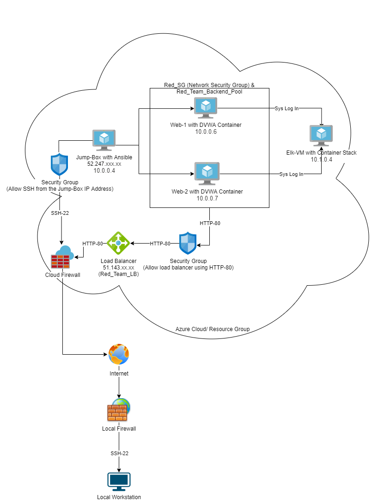

## Automated ELK Stack Deployment Project

The files in this repository were used to configure the network depicted below.



These files have been tested and used to generate a live ELK deployment on Azure. They can be used to either recreate the entire deployment pictured above. Alternatively, select portions of the configuration file may be used to install only certain pieces of it, such as Filebeat.

  - [Ansible Playbook](ansible.cfg)
  - [Ansible Hosts File](hosts)
  - [Elk Playbook](elk.yml)

This document contains the following details:
- Description of the Topology
- Access Policies
- ELK Configuration
  - Beats in Use
  - Machines Being Monitored
- How to Use the Ansible Build


### Description of the Topology

The main purpose of this network is to expose a load-balanced and monitored instance of DVWA, the D*mn Vulnerable Web Application.

Load balancing ensures that the application will be highly secure, in addition to restricting access to the network.
- _Load balancers add a layer of protect from DDoS attacks by routing traffic from one server to another._
- _Jump Box provides advantages of allowing monitoring and logging into all VMs through one box and prevents access to other VMs by restricting IP Addresses from connecting to the Jump Box itself_

Integrating an ELK server allows users to easily monitor the vulnerable VMs for changes to the network  and system logs.
- _Filebeat monitors log files and collects data about the file system._
- _Metricbeat records the metric data and statistics of a server_

The configuration details of each machine may be found below.

| Name     | Function | IP Address | Operating System |
|----------|----------|------------|------------------|
| Jump Box | Gateway  | 10.0.0.4   | Linux            |
| Web-1    | Azure VM | 10.0.0.6   | Linux            |
| Web-2    | Azure VM | 10.0.0.7   | Linux            |
| Elk-VM   | Analytics Platform | 10.1.0.4   | Linux            |

### Access Policies

The machines on the internal network are not exposed to the public Internet. 

Only the Jump Box machine can accept connections from the Internet. Access to this machine is only allowed from my home IP addresses:
- _35.12x.xxx.x_

Machines within the network can only be accessed by IP address.
- _My home laptop was used to access my Elk-VM with my home IP address_

A summary of the access policies in place can be found in the table below.

| Name     | Publicly Accessible | Allowed IP Addresses |
|----------|---------------------|----------------------|
| Jump Box | Yes                 | 52.247.xxx.xx        |
| Web-1    | No                  | 10.0.0.6             |
| Web-2    | No                  | 10.0.0.7             |

### Elk Configuration

Ansible was used to automate configuration of the ELK machine. No configuration was performed manually, which is advantageous because _it allows setups within minutes and can be customizable based on needs._

The playbook implements the following tasks:
- _Create Elk VM_
- _Configure the hosts file found in /etc/ansible/ to Add the Elk VM and Increase Virtual Memory_
- _Install Docker.io_
- _Install Python-pip_
- _Install Docker_
- _Download and Launch the Elk Docker Container_
- _Published Ports 5601, 9200, and 5044_

The following screenshot displays the result of running `docker ps` after successfully configuring the ELK instance.


### Target Machines & Beats
This ELK server is configured to monitor the following machines:
- _Web-1 10.0.0.6_
- _Web-2 10.0.0.7_

We have installed the following Beats on these machines:
- _Filebeat_
- _Metricbeat_

These Beats allow us to collect the following information from each machine:
-_Filebeat collects log events and log files such as Apache and web servers_
-_Metericbeat collects metrics from the system and services that are running such as HAProxy. It also monitors such as filesystem stats, memory stats and VM stats_

### Using the Playbook
In order to use the playbook, you will need to have an Ansible control node already configured. Assuming you have such a control node provisioned: 

SSH into the control node and follow the steps below:

**Filebeat**
- Copy the [filebeat-config.yml](filebeat-config.yml) file to /etc/ansible/.
- Update the [filebeat-config.yml](filebeat-config.yml) file to include Elk machine Private IP address in line 5 and 9.
- Run ansible-playbook filebeat-config.yml, and navigate to http://(Elk machine Public IP address):5601 to check that the installation worked as expected.

**Metricbeat**
- Copy the [metricbeat.yml](metricbeat.yml) file to /etc/ansible/.
- Update the [metricbeat.yml](metricbeat.yml) file to include Elk machine Private IP address in line 2 and 6 as well as username and password in line 3 and 4.
- Run `ansible-playbook metricbeat.yml`, and navigate to http://(Elk machine Public IP address):5601 to check that the installation worked as expected.

_**Bonus**, the specific commands the user will need to run to download the playbook, update are_
```
-------Filebeat---------

- To create the filebeat-configuration.yml file: `nano filebeat-configuration.yml`. For this, I used the filebeat configuration file template.

- To create the playbook: `nano filebeat-playbook.yml`

```
